最近はイラストソフトやレタッチソフトの仕組みに興味があり、ブラウザ上で動作するそんな感じのものをいつかつくれたらいいな〜とぼやぼや考えているところ。

今年の3月あたりからゆるくWebGLとGLSLを触り始め、先週の土曜からはNon-Photorealistic Renderingっぽいものをやっているので、今後ぼちぼちログを残していけたらと思います。

今日は初回なので、ちょっと駆け足。仕組み的な話は追々できたらと。

## はじめてのNPR - クレヨンか？水彩か…？

- [デモ（注：resize処理が雑なので画像を切り替えるとアウトな状態に…）](https://tetracalibers.github.io/webgl-practice-ground/watercolor-pencil-image/)

はじめて階調変換やエッジ検出を組み合わせて絵画っぽい加工を試してみたもの。

- [元画像 - www.beiz.jp](https://www.beiz.jp/%E7%B4%A0%E6%9D%90/%E5%92%8C%E9%A2%A8/00011.html)

GLSLによる加工後。クレヨン画と水彩画を混ぜたような謎のタッチ

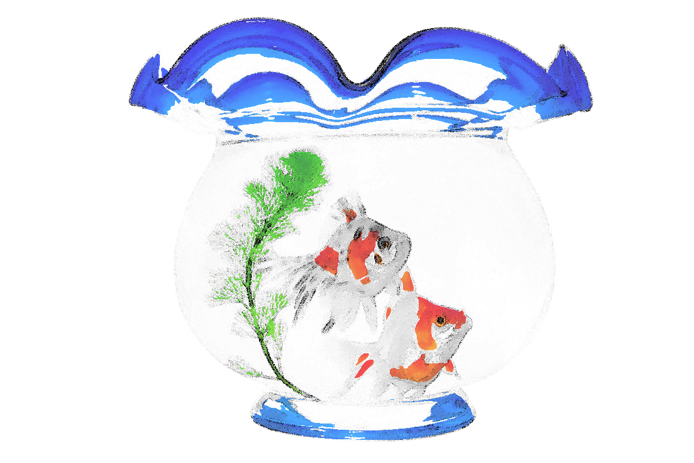

色を抜くとこんな感じ。

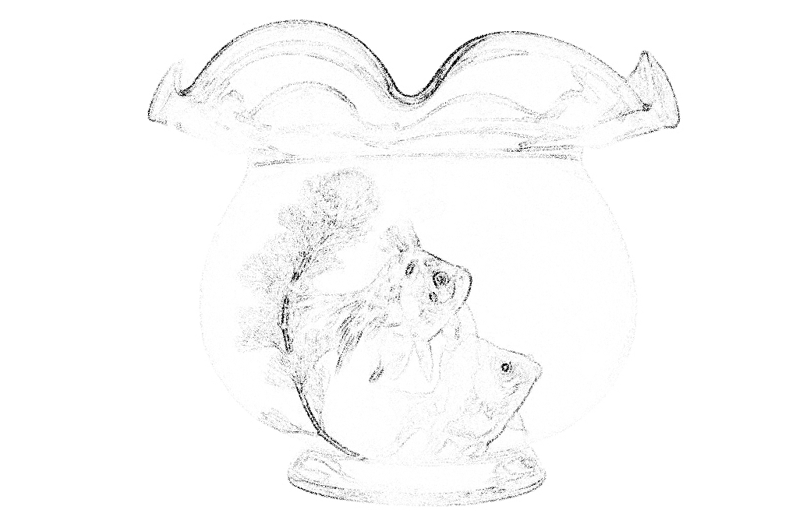

輪郭はクレヨンっぽいのです。

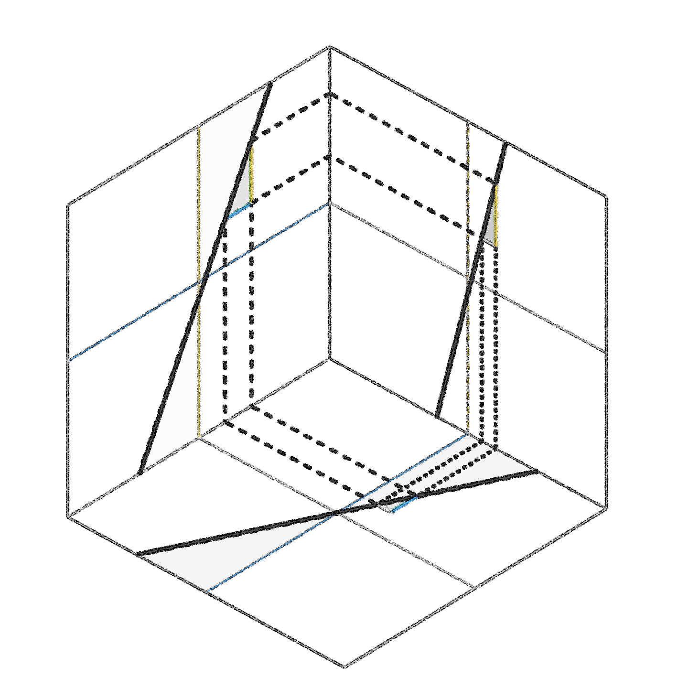

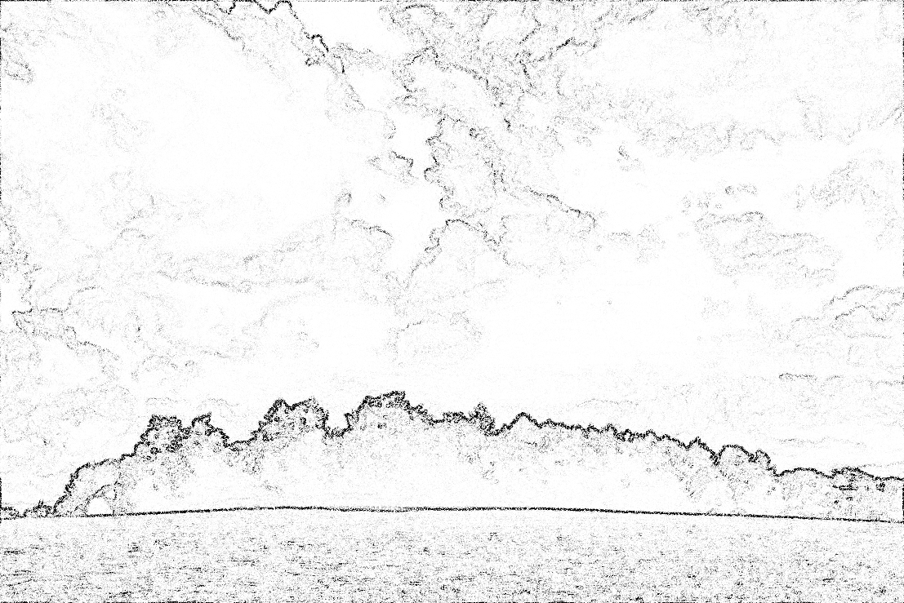

これはちょっと、灰っぽさがある。

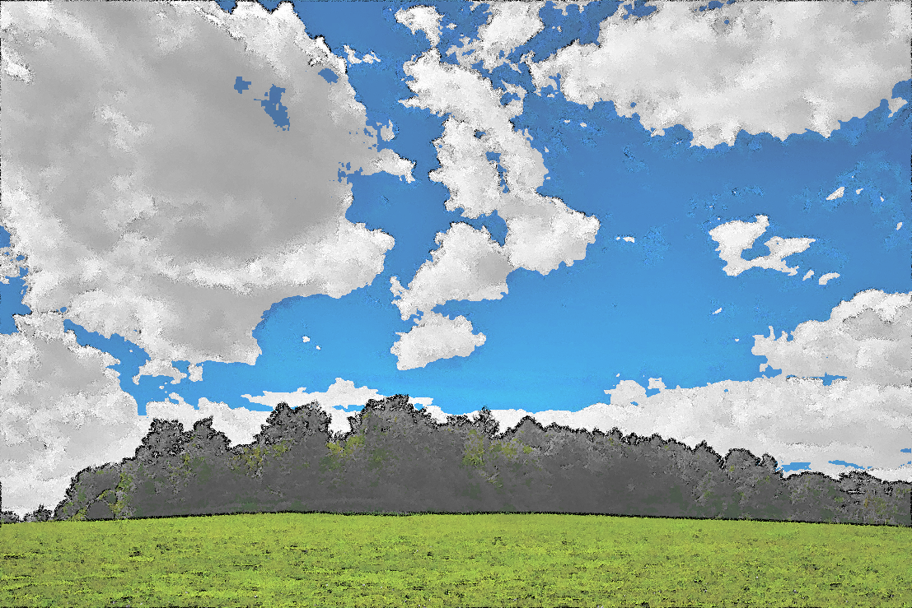

他にも。

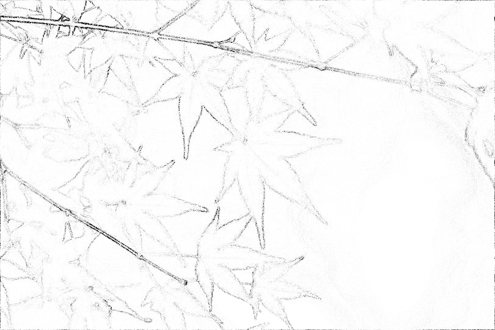

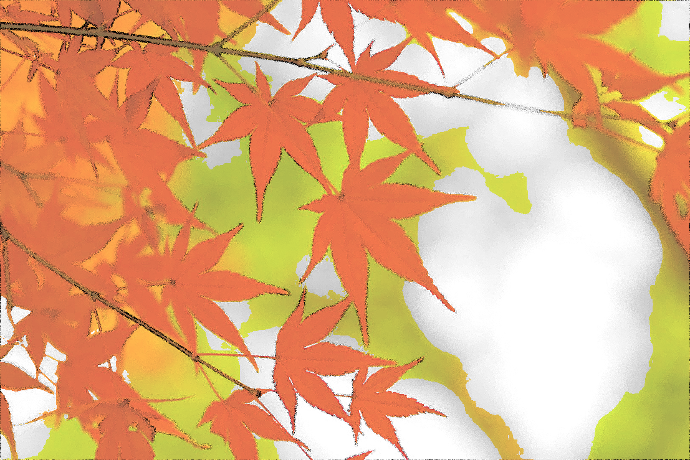

でもスマホだと粒が荒すぎて綺麗には見えません。

- [コードはこちら](https://github.com/tetracalibers/webgl-practice-ground/tree/main/src/canvas/watercolor-pencil-image)

## 2つめのNPR - デッサン風？

- [デモ](https://tetracalibers.github.io/webgl-practice-ground/gray-pencil-image/)

一旦色をつけるのは諦めて、もう少し輪郭の粒が細やかになるように改良したもの。

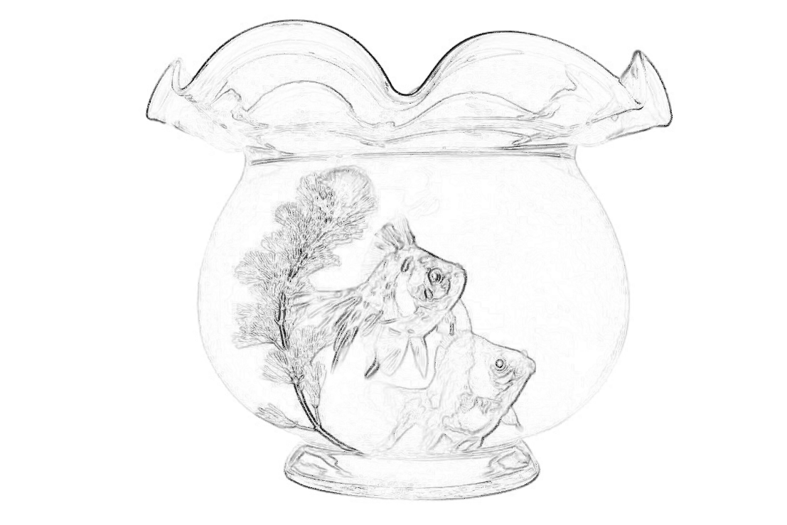

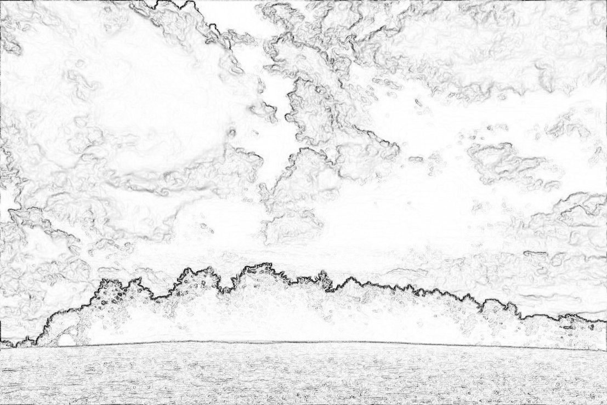

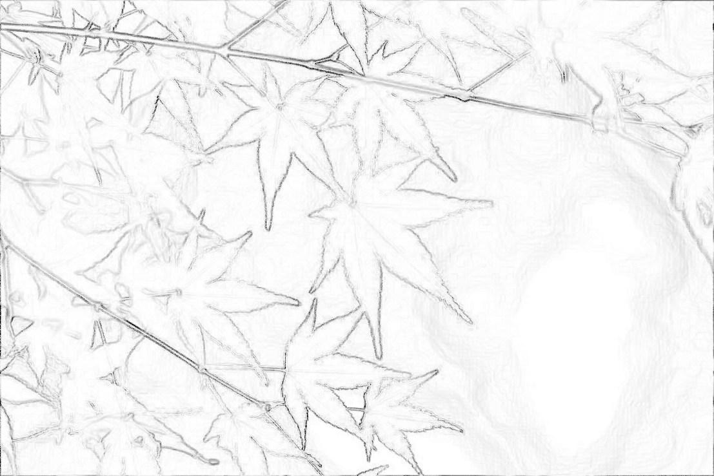

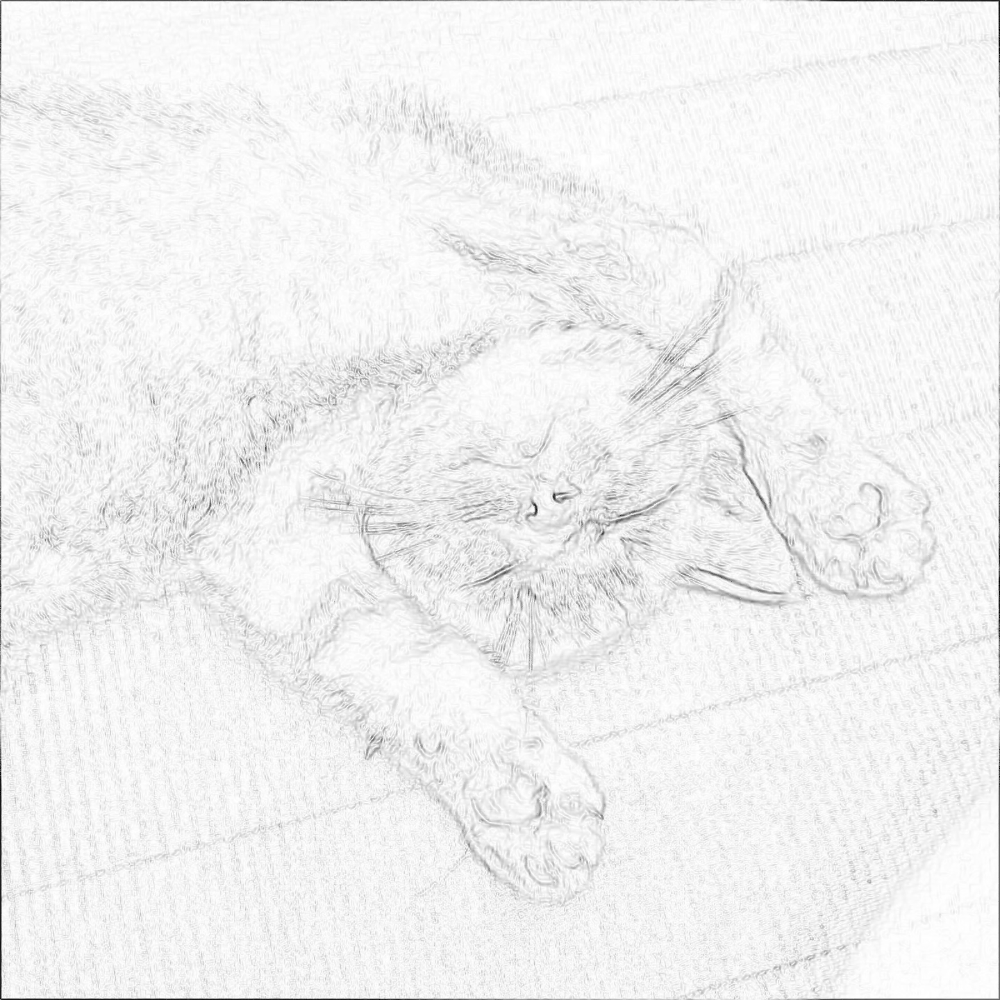

拡大すると渦にも見える、乱数特有のアーティファクトをどう無くすかが課題。

わずかにGaussian Blurをかけるか…うーん。もっと根本的な計算の時点でどうにかならないかな。

- [コードはこちら](https://github.com/tetracalibers/webgl-practice-ground/tree/main/src/canvas/gray-pencil-image)

鉛筆画といってもいろいろあるので、漫画のようにもっとストローク本数が少なくて輪郭がはっきりしたイラスト風加工フィルタも書いてみたい。

流れで色鉛筆イラスト風フィルタも書こうとしたけど、色をつけるとなるとなかなか厄介…階調数低減しちゃうと水彩っぽくなってしまうわけだし。その点に関しては引き出しが足りないなあ。

滲みをつくらないように色のムラをつくるにはどうしたらいいだろう。と考え中。
