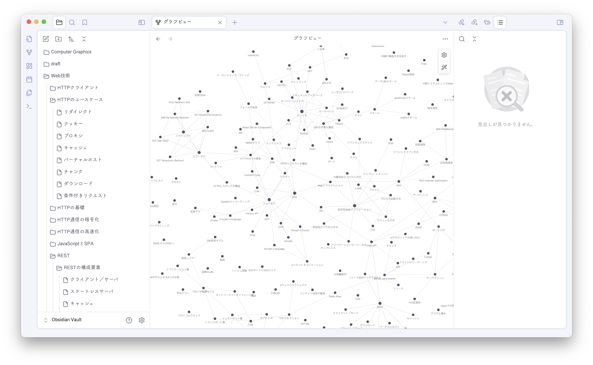
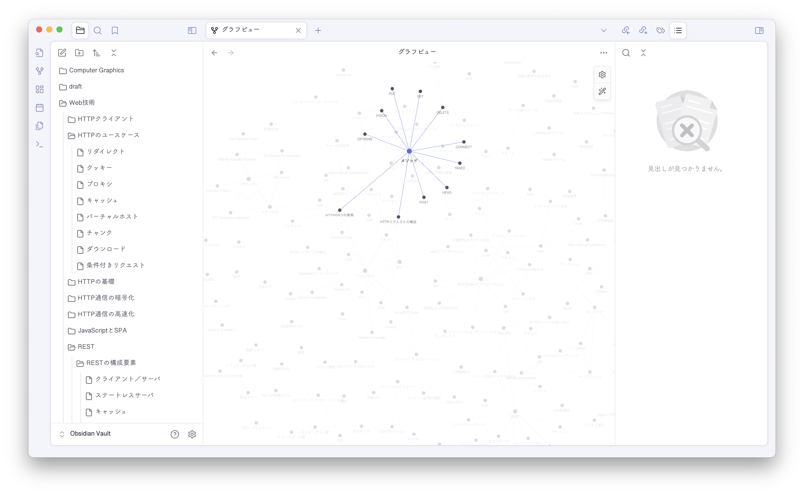

## 知識量の増加＝言語化の難化？

最近、説明が上手い人とそうでない人の違いは何なのか？をよく考える。
それは、自分の中で「うまく引き出すことができない知識」が増えてきているように感じているから。

今から約2年半前、HTML/CSSの基礎を教える講師として勤めていた時期がある。

当時は、今の自分の知識量で人にものを教えていいのだろうかと葛藤していた。だからそれ以来、知識を身につける努力を渋ったことはなかった。

あの頃と比べたら、今は確実に知識も経験も増えているはず。だけど今、たとえば最近熱中しているWebGPUに関して語ってくださいと言われても、言葉に詰まってしまうのだ。

あの頃の方が圧倒的に、知識を言語化して伝えることはうまくできていた気がしている。
それはなぜなのだろうか？…と、考えずにはいられない時期に差し掛かっていた。

## 乱雑な知識データベースの発達

同じ会社に、アウトプットがとてつもなく速い先輩がいる。シリーズ記事全編を数時間で書き上げてしまうような…

当然、その先輩はプレゼンも上手い。スライドには簡潔な要約だけが書かれていて、口頭で淀みなく詳細を付け加えることができる。どこまで詳しく話すか、というコントロールも自由自在で、残り時間や聞き手の反応によって柔軟に情報の流量を出し分けているのがわかる。

なぜそれほどまでにアウトプットが速くて、柔軟なのか。
それは、「整理する」というフェーズをそもそも踏んでいないからなのかもしれない。

その先輩にとっては、記事執筆もプレゼンも、ただ頭の中にある情報を引き出しているだけなのだと思う。
つまり、情報はすでに整理されている状態で頭の中に格納されている。だから知識へのアクセスが高速で、それを引き出す時にフォーマットする必要もないのではないか。

そんな仮説を思いついた時、その対比として、自分の今の知識の状態が理解できた気がした。
私の中にある知識は、関連付けもグループ化もできていない。点を増やすばかりで、その間に線を引く作業も、それらをまとまりごとに囲む作業もすっ飛ばして生きてきた。

このような状態では、知識量が増えていくごとに、知識へのアクセスの難易度は逆に増していく。そんな現象は、データベース設計のアナロジーで容易に説明がつく。

適切な形に整頓されていないデータベースは、データ量が増えるごとに、データの検索に膨大な時間がかかるようになっていくだろう。データ同士の関係をうまく構造で表現できていないデータベースは、関連するデータを合わせて引き出すことはできない。

## 知識の格納方法を変えたい

いくら知識があっても、頭の中で知識を構造化できていなければ、わかりやすい言語化はできない。頭の中にツリーを構築できていれば、かいつまんで話すこと（要約）もできるし、その場で詳しい説明を付け加えることもできる。

では、どうすれば知識を構造化できるのだろうか？
少なくとも私の場合、知識を整理するには「書く」ことが必要不可欠だと感じていた。だから読書ノートの最適解を見つけたい。

具体的な方法として、インプットする際にツールを使って、情報の構造を可視化することを試みてきた。

- プレーンなMarkdownファイルに要約を書く
- マインドマップでトピックの関係性を視覚化する
- …

## 最近の試み：Obsidianでwikiを作る

いろいろな方法を試した末、最近は[Obsidian](https://obsidian.md/)というMarkdownベースのメモアプリが気に入っている。
Obsidianはリンク機能を強化したMarkdownファイル管理ツールのようなもので、情報そのものだけでなく、その関係を表現することを重視した機能を持つ。

> Create connections between your notes. ... Invent your own personal Wikipedia.

知識を関連づけて整理する上では、Obsidianが最強かもしれない…というお気持ちだけ語ってみる。
個人的な感動を語るだけでは魅力を伝えきれないのは重々承知だが、Obsidianの特徴や機能の解説は以下に代表される他の記事に任せるとして…

- [ノートアプリ「Obsidian」を使いこなす - gihyo.jp](https://gihyo.jp/list/group/%E3%83%8E%E3%83%BC%E3%83%88%E3%82%A2%E3%83%97%E3%83%AA-Obsidian-%E3%82%92%E4%BD%BF%E3%81%84%E3%81%93%E3%81%AA%E3%81%99)
- [さようなら、全てのエヴァーノート](https://honeshabri.hatenablog.com/entry/Evernote_to_Obsidian)

### 関連付けの煩雑さを解消する

Obsidianに出会う前は、1冊ごとにMarkdownファイルを1つ作成して本の要約を書いていた。

ObsidianもMarkdownで書くメモアプリなので、手段としては一見あまり変わっていないように見えるかもしれない。
が、自分でMarkdownファイルを作成する方式はいろいろと不自由だったように思える。

まず、1冊ごとに1つのMarkdownファイル、という粒度がよくなかった。

段階的／多面的に理解を深めるために、同トピックの本を複数冊読むことはよくある。入門書を読んだらより詳細な本にステップアップしたり、実践型の本と理論解説型の本を並行して読んでみたり。

それらを1冊ごとに分けてまとめてしまうと、同じトピックに関する要約が複数ファイルに分散してしまい、最終的に自分の中でそのトピックをどう解釈するか？という知識の統合が難しくなる。

1冊ごとではなく、トピックごとに1つのノートを作るのが理想的だといえる。

しかし、それぞれのトピックを単体のMarkdownファイルにまとめてしまうと、今度はトピックを関連づける方法が悩ましい。
ローカルのファイル同士をMarkdownリンクで繋げる方式では、トピックをカテゴリごとに分類する目的でディレクトリ構成を見直したくなったときに、リンクの修正が面倒になる。

Obsidianの[Internal links](https://help.obsidian.md/Linking+notes+and+files/Internal+links)機能は、この問題を完全に解決してくれた。

> Obsidian can automatically update internal links in your vault when you rename a file.

リンクの自動更新のおかげで、心置きなく「1ページに1トピック」を徹底することができる。

用語ごとにページを作成し、他のページの本文中にその用語が登場したら、内部リンクを設定する。内部リンクの双方向性も魅力的で、リンク元のページにも自動的にバックリンクが設定されるので、逆引きも可能な単語帳として機能する。

> By linking notes, you can create a network of knowledge.

Obsidianの思想は、「知識を関連づけて理解する」という目的そのものだった。

### 一度に目に入る情報量を減らす

トピックの関連性を整理するために、マインドマップを使うことも多かった。
しかし、マインドマップはあらゆる情報の整理に向いているかというと、そうではない。

- 詳細を掘り下げた情報を保持させるのが難しい
- 複雑に絡み合う情報を表現しようとすると、その複雑さだけが可視化されてしまう面もある

より詳細な知識へと向かうにつれて、マインドマップという1枚絵はどんどんカオスになっていく。各ノードは長文化していくだろうし、関連を表す目的でノード同士を繋ぐ線も、絡まった糸のようなビジュアルになる。

詳細情報をどんどん書き足していきたいなら、全体像の可視化にこだわるよりも、1トピックごとに分割した方が良い。リンクを駆使すれば、いくら分割してもその関連性が絶たれることはないし、絡み合う線を目で追うより、リンクを辿った方が復習のスピードも上がる。

### 自然な理解の流れに沿う

また、マインドマップの作成は、同時に考えなければならないことが多い複合タスクでもあった。

情報を可視化表現に一気に昇華しないといけないのはつらい。理解することと、それを表現すること（見た目やキャッチフレーズ化にこだわること）は分離して、段階的にできた方がいい。

そもそもマインドマップは最初から要約しなければ情報を収めることができないので、理解がまだ浅い知識を書き殴るにはハードルが高すぎるというのもある。
どのノードから派生させるか？をまず考えなきゃならないし、最終目標であるはずの知識の構造化がまずできていないと、何も書き始められない感覚があった。

その点、Obsidianは個の知識を深めた上で、後から要約したり、他とリンクさせたりできる自由度が良い。自然な理解の過程に沿って育てられる感覚がある。

> Obsidian is the private and flexible writing app that adapts to the way you think.

このキャッチフレーズに嘘はない…

### 知識をネットワークとして育てる

知識体系が育ってきている実感を得る上で、全体像を可視化できるマインドマップはかなり優秀だったが、Obsidianでも[グラフビュー](https://help.obsidian.md/Plugins/Graph+view)を使うことでその実感が得られる。

トピックの詳細情報が子トピックとして表示されてしまうマインドマップとは違って、Obsidianのグラフビューではトピック名だけが表示されるのも良い。

トピック（ページ）を表す点にカーソルを乗せると、リンクで紐付けた関連トピックだけがハイライトされる。

どこにも繋がっていない孤独な点は、まだ単体でしか理解できていないトピックだともいえる。今日はどのトピックを深掘りするか、次の学習対象を探す用途でもグラフビューを使っている。

まだ使い始めて間もないObsidianだが、知識を繋げて広げていく感覚が手に取るようにわかってくるのが楽しい。

これからもこのネットワークを、少しずつ育てていきたい。
