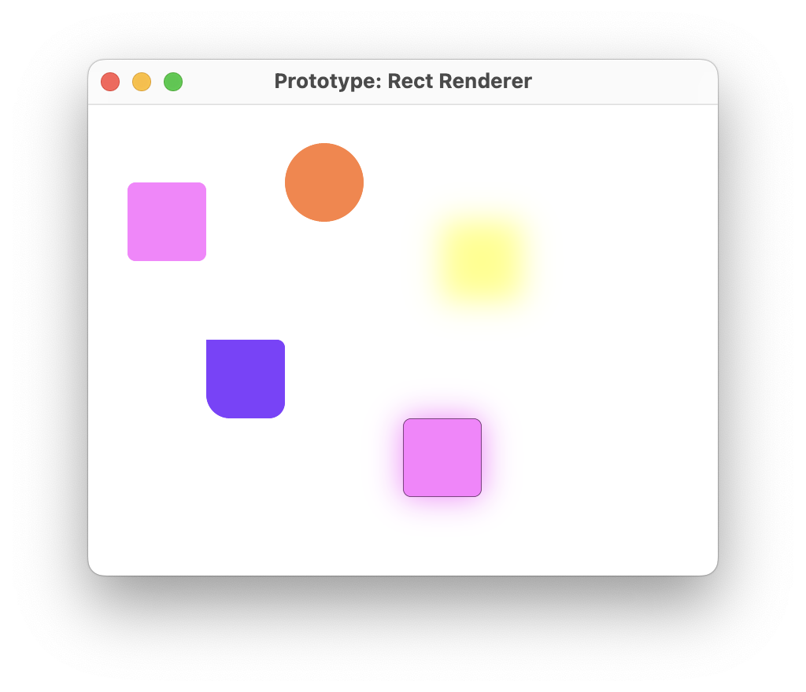

import { LinkPreview } from "astro-embed"

## Thousands of Styled Rectangles in 120FPS on GPU

WebGPUによる、スタイル付き長方形レンダラーのフルスクラッチ実装記事。
矩形や角丸矩形をSDFで描画するなど、GPUならではの手法がたくさん使われていて、とても興味があった。

<LinkPreview id="https://tchayen.com/thousands-styled-rectangles-in-120fps-on-gpu" />

この記事はJSでの実装だが、Rust（wgpu）への移植をやってみた。

<LinkPreview id="https://github.com/tetracalibers/wgpu-practice-ground/pull/16" />

シェーダーのアルゴリズムもまだ完全には理解しておらず、MSAAも未知の概念だったので、どこかで時間をかけて研究したいなと思った。
