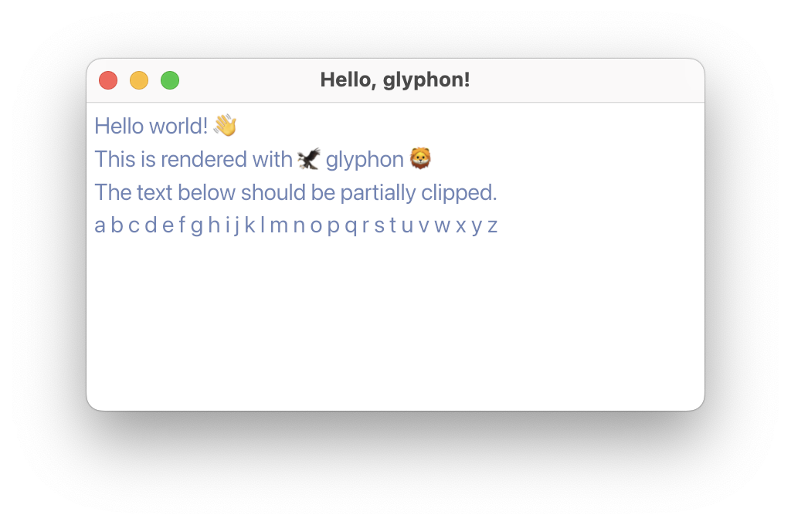

import { LinkPreview } from "astro-embed"

## Hello, glyphon!

[glyphon](https://docs.rs/glyphon/latest/glyphon/)というwgpu向けテキストレンダリングライブラリは、公式のチュートリアルが充実している。

<LinkPreview id="https://github.com/grovesNL/glyphon/blob/main/examples" />

このうち、`hello-world.rs`を、最新版winitで書き換えつつ写経してみた。

<LinkPreview id="https://github.com/tetracalibers/wgpu-practice-ground/pull/17" />

### 苦労したこと

- text boundsは自前で計算して設定する必要があるが、その計算方法がわからず、文字が見切れて調整に苦労した…
- 最新版のwgpuと合わせて使おうとしたら、glyphonの内部依存の関係で動かず、バージョンを下げる必要があった
- サンプルチュートリアルでは、公開されていないライブラリの内部のAPIが直接使われている箇所がいくつか…代替手段やベストプラクティスがわからない

## Encapsulating Graphics Work

<LinkPreview id="https://github.com/gfx-rs/wgpu/wiki/Encapsulating-Graphics-Work" />

glyphonのREADMEにリンクが貼られていて、非常に参考になった記事。
この前、gif生成に対応するために自分なりにリファクタリングしたコードでも、知らずに実践できていたのでちょっとうれしい。
`prepare`関数の返り値を`render`関数の引数に指定する設計にすることで、呼び出し順を強制できる…というアイデアに納得。今後参考にしていきたい。

## Next

- glyphon内部で使われている、[cosmic_text](https://docs.rs/cosmic-text/latest/cosmic_text/index.html)を触ってみたい
- [Drawing Text in WebGPU Using Just the Font File](https://tchayen.com/drawing-text-in-webgpu-using-just-the-font-file)をRustに移植したい
